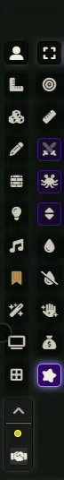
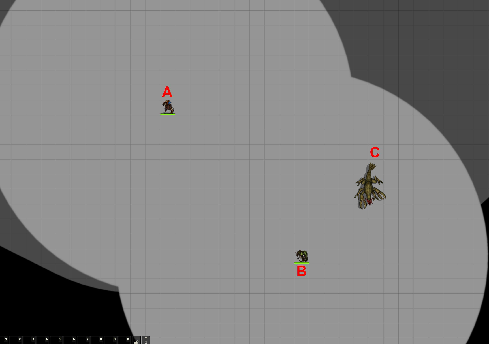
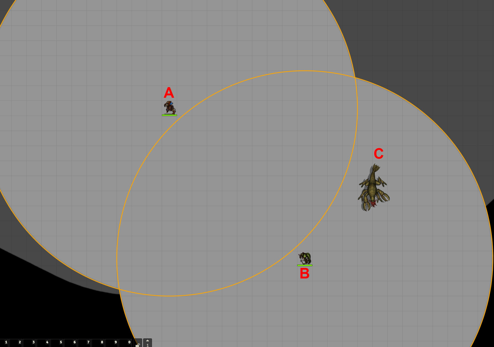

[Discord](https://discord.gg/VMqndcyUGS)

# Introduction
This module provides minor QoL additions

## Scrollable sidebar
Having a lot of modules sometimes means having a lot of buttons on the left sidebar. For smaller displays that can be a problem and users might not be able to see every button.
This addition adds a scrolling functionality (without a scrollbar). The sidebar can now be scrolled with the mouse wheel or click and drag.

## Change opacity of hidden drawings
I sometimes can't find some GM notes on the scene because the alpha is too low.
With this setting you can adjust to any value you like (libWrapper required)

## Vision Rings
Enable a ring to better see what each token's visual range is.
Useful when you use a common display where you don't click on specific,
and therefore it is not obvious what each character can see.

- You can use the 'R' key (this can be changed in foundry's 'Configure Control') to toggle the rings
- In the settings, you can also activate a second ring and change the colors

### Example
On this common screen, both players have darkvision.
B can see C, but it is not obvious that A is actually too far away to see C.

This gets more obvious with vision rings

### Support
If you like to support my work find me on [Patreon](https://www.patreon.com/SyriousWorkshop).
